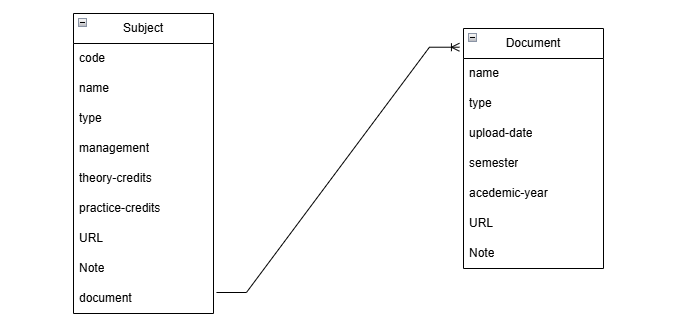

# Drive Search ok

## Drive search database

### Subject
| Column Name  | Data Type   | Constraints    |  Description  |
|--------------|-------------|----------------|---------------|
| code         | string      | NOT NULL       |  Mã môn học
| name         | string      | NOT NULL       |  Tên môn học
| type         | string      | NOT NULL       |  Phân loại môn học (Đại cương, Chuyên ngành,...)|
| management   | string      | NOT NULL       | Khoa quản lí (KTMT, KHMT, ...)  |
|theory-credits| int         | NOT NULL       | Số tín chỉ lí thuyết |
|practice-credits| int       | NOT NULL       | Số tín chỉ thực hành |
| URL          | string      | NOT NULL       | url của folder môn học |
| Note         | string      |                | ghi chú       |
| documents    |             |                | relationship ( 1 to many) with **documents** |

### Documents
| Column Name  | Data Type   | Constraints    |  Description  |
|--------------|-------------|----------------|---------------|
| name         | string      | NOT NULL       | tên file      |
| type         | string      | NOT NULL       | loại file (docx, pptx,...)|
| upload-date  | datetime    | NOT NULL       | thời gian upload file |
| semester     | string      |                | học kì (HK1, HK2)|
| academic-year| string      |                | năm học của tài liệu (2023 - 2024,...)|
| URL          | string      | NOT NULL       | url của file tài liệu |
| Note         | string      |                | ghi chú       |
